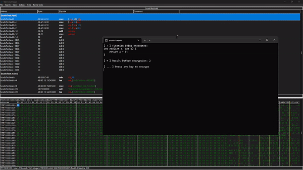

# Scudo
 

 Scudo is a C++ library that provides a method to encrypt sensitive functions all while being able to dynamically execute the function. This offers a concise solution for securing and executing encrypted functions in your codebase.
 
 ## Usage
 
 
 Include all the files included in the project and simply create a new class with your desired function's address as the parameter. 

```cpp
Scudo protectedFunction(&Function);

// Call your function whenever you want 
...
```

You can see the [example](https://github.com/B64-Cryptzo/Scudo/blob/main/Scudo/B64EncryptionDemo.cpp) that shows a demo function take in parameters and return a value.

## Compatibility
In order to fully take advantage of the capabilities of Scudo, ensure that you disable program optimization in your project settings. Set the project to release mode aswell to avoid having to calculate the entrypoint to your functions manually.

## Performance
Due to the use of a breakpoint to notify the routine to re-encrypt the function, we reduce the time it takes for the function to get decrypted, executed, and re-encrypted by about 97%. Through testing, we've concluded that with encryption enabled, functions only run 2% slower than unencrypted functions. 

## Technical Explanation
Functions in memory are only accessible after compilation. That is why in order to encrypt functions at runtime, we have to determine the size in bytes of our function in addition to the address before compiling. 

To accomplish this we do the following:
- Use an opcode disassembler like [capstone](https://github.com/capstone-engine/capstone) to read the function bytes until we reach [0xCC](https://en.wikipedia.org/wiki/INT_(x86_instruction)#:~:text=The%20INT3%20instruction%20is%20a,are%20encoded%20using%20two%20bytes.) since functions in memory are typically alligned using 0xCC instructions
- Use function pointers to determine the address of a function in memory. This can be trivial because depending on whether you're in debug mode or release, functions are referenced differently.

Now that you understood the way we obtain our function information, I can explain how the class encrypts and decrypts functions.

- Encryption: With the size and address of the function, we start by saving the first byte of the function to a class member variable. We then replace it with a 0xCC debuging byte and xor encrypt the rest of the function with a random 10 character long encryption key. 

- Decryption: To be able to run the function, we install an exception handler that will check a map of all our encrypted function for any function at the address of the exception. It will then decrypt the associated function and set a breakpoint at the function's return address. After the function finishes execution, the function is re-encrypted automatically and the breakpoint at the return address is removed.

## Resources
- [Exception Handler](https://learn.microsoft.com/en-us/windows/win32/debug/vectored-exception-handling)
